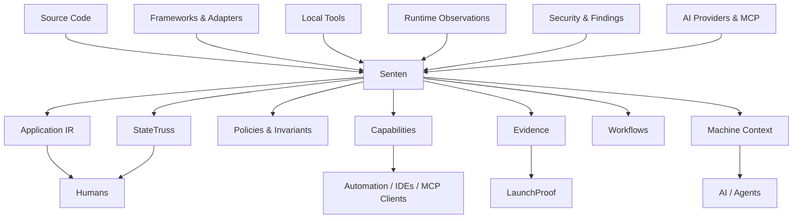

# Senten

<p align="center">
  <strong>Semantic application architecture for secure, explainable, cross-platform living software.</strong>
</p>

<p align="center">
  <strong>Understand. Operate. Protect. Explain.</strong>
</p>

<p align="center">
  <a href="https://www.npmjs.com/package/senten"></a>
  <a href="https://www.npmjs.com/package/senten"></a>
  <a href="https://github.com/thomasdscx/senten/blob/main/LICENSE"></a>
  
</p>

---

## What is Senten?

Senten is a semantic architecture and project-intelligence framework that helps humans, tools, and AI systems understand a software project as a **system**, not just a folder of files.

It builds and maintains structured project knowledge across source code, routes, actions, resources, providers, policies, invariants, runtime evidence, workflows, local tools, security boundaries, change history, AI capabilities, and MCP access.

Senten does **not** replace your framework, database, CLI tools, CI system, security scanners, or AI models.

It gives them a shared semantic and operational layer.

> Frameworks build the application. Tools operate the environment.  
> **Senten understands the system around them.**

---

## Why Senten?

Modern software is rarely one thing.

A real application may span:

- multiple frameworks and packages
- APIs, routes, background jobs, data stores, and external providers
- Git, Docker, package managers, CLIs, and build systems
- local, containerized, cloud, desktop, mobile, and edge environments
- human developers and autonomous or semi-autonomous AI agents
- MCP servers and machine-readable tool interfaces
- runtime observations, tests, security findings, and release evidence
- decisions and architectural knowledge that are otherwise lost between sessions

Most tools understand only one slice.

Senten creates a durable semantic layer across those slices so you can answer questions such as:

- **What is this project?**
- **How do these parts relate?**
- **What will this change affect?**
- **Why does this route or action exist?**
- **Which resources or trust boundaries does it cross?**
- **What tools are available in this environment?**
- **What evidence says this behavior actually works?**
- **What can an AI agent see or do?**
- **What changed, who changed it, and can we recover?**
- **What is known, and what is still unknown?**

---

## Install

Senten is available on npm.

```bash
npm install -g senten
```

Requirements:

- Node.js 22.5 or newer
- Windows, macOS, or Linux

Verify:

```bash
senten --version
```

---

## Try Senten in 60 seconds

Run Senten inside an existing project:

```bash
cd my-project

senten init
senten discover
senten doctor
senten adopt
senten ask project
```

You now have a Senten project model that can be inspected, queried, extended, compared, protected, and used by humans or machine interfaces.

A useful next step:

```bash
senten ask architecture
senten ask frameworks
senten security status
senten tool discover
senten impact <element>
```

---

# What Senten can do

## 1. Understand an existing codebase

Senten can adopt an existing application without requiring a rewrite.

```bash
senten init
senten discover
senten adopt
```

Discovery builds an **Application IR** and persistent **StateTruss** graph representing what Senten can safely infer about the project.

Depending on available evidence, Senten can model concepts including:

- files and modules
- UI components
- routes and API handlers
- actions
- resources and data entities
- providers and dependencies
- tests
- policies and invariants
- capabilities
- application and workspace relationships

Inspect the result:

```bash
senten graph
senten inspect
senten why route:/api/projects
senten lineage action:user.update
```

### Existing-app adoption

Use Senten when you inherit, revisit, or need to explain a project:

```bash
senten adopt --details
senten ask project
senten ask architecture
senten ask frameworks
```

Senten separates what it can prove from what is merely absent or unknown.

**Unknown does not mean passed. Unsupported does not mean unsafe.**

---

## 2. Understand change before you make it

StateTruss gives Senten a persistent semantic graph instead of relying only on text search.

```bash
senten impact action:user.update
senten lineage resource:users
senten why route:/admin/users
```

Create and compare architecture baselines:

```bash
senten baseline accept
senten discover
senten drift
senten diff
```

This helps answer:

> If I change this, what else may be affected?

That becomes increasingly valuable in large applications, monorepos, legacy systems, and AI-assisted development.

---

## 3. Give AI structured project context without giving it everything

Senten separates **project intelligence** from **AI reasoning**.

Deterministic project context requires no AI model:

```bash
senten ask project
senten ask architecture
senten ask security
senten ask changes
senten ask tools
```

Machine-readable output is available:

```bash
senten ask project --format json
senten ask project --budget 1200
```

Sensitive AI-facing topics can require explicit grants:

```bash
senten ask changes --for-ai
senten ai permissions
senten ai grant read:changes --ttl 30m
```

Human authority and AI authority are intentionally separate.

---

## 4. Use local AI providers through a provider-neutral layer

Senten can discover and use supported local or compatible AI endpoints without making any one AI vendor part of the architecture.

```bash
senten ai discover
senten ai list
senten ai status
```

For local providers such as Ollama:

```bash
senten ai models ollama
senten ai use ollama <model>
senten ai ask "Explain this project's architecture"
```

Generic OpenAI-compatible endpoints can also be registered:

```bash
senten ai provider add my-provider \
  --endpoint http://localhost:1234/v1 \
  --protocol openai-compatible
```

Credential configuration can reference environment variables rather than storing API secrets in plaintext project configuration.

---

## 5. Use MCP as a governed interface to Senten

Senten includes an MCP-facing stdio interface.

```bash
senten mcp doctor
senten mcp schema
senten mcp config
senten mcp serve
```

The MCP surface is designed around Senten capabilities rather than unrestricted shell access.

Default policy is read-oriented, and AI-facing context requests pass through Senten's policy layer.

This allows AI clients and agent systems to consume project intelligence without turning Senten into an unbounded remote terminal.

---

## 6. Discover and operate existing tools instead of replacing them

Senten's **Tool Fabric** discovers capabilities already installed in the environment.

```bash
senten tool discover
senten tool list
senten tool inspect git
senten tool inspect docker
```

Use a tool:

```bash
senten use git status
senten use docker version
```

Or use the canonical machine-oriented form:

```bash
senten tool run docker ps
```

Register a custom executable:

```bash
senten tool register mytool "D:\Tools\mytool.exe"
```

Senten's role is not to rebuild Git, Docker, package managers, or your existing CLI ecosystem.

It understands and orchestrates them.

---

## 7. Teach Senten new semantics with adapters

Tools provide executable capabilities.

**Adapters provide understanding.**

Senten's Adapter Fabric lets an ecosystem teach Senten how to recognize and model framework-specific behavior.

```bash
senten adapter list
senten adapter create my-adapter
senten adapter validate my-adapter
senten adapter test my-adapter
senten adapter doctor my-adapter
```

First-party architecture work includes adapters and integrations for ecosystems such as React, Next.js, Expo, Tauri, Supabase, Drizzle, Git, and LaunchProof.

Senten remains framework-agnostic at its core.

---

## 8. Build deterministic workflows

Turn repeated project operations into explicit workflows:

```bash
senten workflow create pre-release --empty

senten workflow add pre-release -- doctor
senten workflow add pre-release -- discover
senten workflow add pre-release -- drift --strict

senten workflow validate pre-release
senten workflow plan pre-release
senten workflow run pre-release
```

Workflows are inspectable rather than hidden automation.

```bash
senten workflow inspect pre-release
senten workflow history pre-release
```

---

## 9. Track project activity and change

Senten can keep human-readable project activity records.

```bash
senten activity --today
senten activity --changes --last 2h
senten activity --failures
```

Export activity:

```bash
senten activity export --yesterday --format md
```

Watch project changes:

```bash
senten listen
```

Or focus on part of a project:

```bash
senten listen apps/studio
```

This gives human and agent-driven work a durable project timeline.

---

## 10. Create verified project checkpoints

Create a physical checkpoint before risky work:

```bash
senten checkpoint create before-auth-refactor
```

Compare later:

```bash
senten checkpoint diff before-auth-refactor
```

Preview restoration:

```bash
senten checkpoint restore before-auth-refactor --dry-run
```

Restore when needed:

```bash
senten checkpoint restore before-auth-refactor
```

Senten creates a recovery checkpoint before restoration.

---

## 11. Protect sensitive Senten state

Senten includes a project security model for sensitive project intelligence.

Inspect it:

```bash
senten security status
senten security surface
senten security boundaries
senten security exposure
senten security doctor
```

Configure a human passphrase:

```bash
senten security passphrase set
```

Change an existing passphrase:

```bash
senten security passphrase change
```

Recovery workflows:

```bash
senten security recovery status
senten security recovery rotate
senten security recover
```

Lock protected state:

```bash
senten security lock
```

Create a scoped human unlock:

```bash
senten security unlock workflows --ttl 10m
```

Senten's security model includes protected-state encryption, masked interactive secrets, recovery material, bounded authentication attempts, and separation between human authorization and AI permissions.

Senten does not claim to defeat a fully compromised operating system. Its goal is meaningful application-layer governance and protection of sensitive project intelligence at rest and during normal operation.

---

## 12. Capture evidence instead of assuming success

Senten distinguishes between what was:

1. **declared**
2. **observed**
3. **tested**
4. **verified**

Runtime observations can become evidence:

```bash
senten runtime status
senten runtime observe invariant:tenant-isolation \
  --kind invariant \
  --status passed
```

Inspect evidence:

```bash
senten evidence summary
senten guarantee invariant:tenant-isolation
senten proof
```

The core rule is simple:

> **Unknown ≠ passed.**

---

## 13. Produce detailed execution reports

Record a sequence of work:

```bash
senten report start release-check

senten doctor
senten discover
senten test

senten report stop
```

Inspect and compare records:

```bash
senten report list
senten report show <record>
senten report compare <record-a> <record-b>
```

Export project evidence in portable formats:

```bash
senten report export <record> --format md
```

Reports preserve command outcomes including passes, failures, denials, unavailable operations, and other execution states instead of collapsing everything into a binary success claim.

---

## 14. Use sandboxes for safer experimentation

Create isolated working environments:

```bash
senten sandbox create
```

Or use Docker when available:

```bash
senten sandbox create --provider docker
```

Senten is explicit about the containment properties of each sandbox.

A local workspace copy is useful isolation, but Senten does not falsely describe it as a full security boundary.

---

## 15. Model runtime behavior and critical journeys

Static analysis is only part of a living system.

Senten can represent runtime observations:

```bash
senten runtime status
senten runtime traces
senten runtime alignment
```

Discover HTTP navigation:

```bash
senten crawl http://localhost:3000
senten paths
```

With Playwright installed, browser interaction analysis is available:

```bash
senten clickthru http://localhost:3000 --browser chromium
```

Critical flows can be represented as deterministic journeys:

```bash
senten journey create checkout http://localhost:3000
senten journey run checkout --browser chromium
senten journey history
```

---

## 16. Exchange assurance evidence with LaunchProof

Senten and LaunchProof have intentionally different responsibilities.

**Senten asks:**

> What is this system, and what do we know about it?

**LaunchProof asks:**

> What evidence says this software is ready to ship?

Export semantic claims and evidence:

```bash
senten assurance claims
senten launchproof export
```

Import independent verification:

```bash
senten launchproof import launchproof-result.json
senten launchproof status
```

This keeps application intelligence and release assurance separate while allowing them to interoperate.

---

# Example use cases

## "I inherited a codebase and need to understand it"

```bash
senten init
senten discover
senten adopt --details
senten ask project
senten ask architecture
```

Use `why`, `lineage`, `graph`, and `impact` to move from inventory to relationships.

---

## "An AI agent is modifying my project"

```bash
senten ask project --format json --budget 1500
senten ai permissions
senten activity --changes --today
senten checkpoint create before-agent-work
```

Senten gives the agent structured project context while preserving explicit authorization boundaries and an auditable project history.

---

## "I'm about to refactor authentication"

```bash
senten checkpoint create before-auth
senten impact action:login
senten lineage resource:user
senten security boundaries
senten workflow run quality
```

You can reason about dependencies, establish a rollback point, and preserve evidence of the resulting work.

---

## "I want one workflow across different projects"

```bash
senten workflow create quality --empty
senten workflow add quality -- doctor
senten workflow add quality -- discover
senten workflow add quality -- test
senten workflow validate quality
```

The workflow describes the intent while Senten resolves project-local execution capabilities.

---

## "I need AI context but don't want to expose everything"

```bash
senten ask project
senten ask security --for-ai
senten ai permissions
```

Sensitive categories can require explicit, expiring human grants.

---

## "I need to know whether software is actually ready to ship"

Use Senten to model the application and gather project/runtime evidence.

Use LaunchProof to evaluate independent release assurance.

```bash
senten launchproof export
```

---

# Architecture



At the center is a simple idea:

> A software system should have a durable model of itself.

---

# Core concepts

| Concept | Purpose |
|---|---|
| **Application IR** | Portable semantic representation of the application |
| **StateTruss** | Persistent graph of project elements and relationships |
| **Universal Elements** | Stable references to meaningful project objects |
| **Policies** | Explicit rules governing behavior or access |
| **Invariants** | Conditions the system is expected to preserve |
| **Capabilities** | Provider-neutral description of what can be done |
| **Tool Fabric** | Discovery and invocation of installed tools |
| **Adapter Fabric** | Framework/platform-specific semantic understanding |
| **Evidence** | Structured record of declared, observed, tested, or verified facts |
| **Workflows** | Deterministic, inspectable project automation |
| **Checkpoints** | Recoverable project-state boundaries |
| **Activity** | Human/agent command and change history |
| **Ask** | Deterministic project-context retrieval |
| **AI Providers** | Optional model reasoning over Senten-governed context |
| **MCP** | Governed machine interface to Senten capabilities |

---

# What Senten is not

Senten is not trying to replace:

- React, Vue, Next.js, Expo, Tauri, or your application framework
- Git
- Docker
- PostgreSQL, Supabase, or your database
- npm, pnpm, or your package manager
- CI/CD systems
- SAST, SCA, DAST, cloud posture, or runtime security platforms
- your IDE
- your AI model
- your release-assurance system

Those systems already have specialized jobs.

Senten is the layer that helps connect their meaning.

Security scanners can produce findings.  
Runtime systems can produce observations.  
Tools can perform operations.  
AI can reason.

**Senten supplies structured project truth and governed context.**

---

# Framework and language support

Senten's architecture is framework-agnostic.

The v1 source-intelligence implementation has its deepest first-party analysis for JavaScript/TypeScript ecosystems, with adapters and semantic support across several web, mobile, desktop, data, and integration technologies.

Other ecosystems can be represented through:

- explicit semantic declarations
- adapters
- Application IR fragments
- runtime evidence
- external findings
- extension packages

Broader language and framework understanding can evolve without changing Senten Core.

---

# Security philosophy

Senten follows several principles:

- **Evidence before claims**
- **Unknown ≠ passed**
- **Human authority and AI authority are separate**
- **Destructive operations should not happen silently**
- **Sensitive machine context should be scoped**
- **External tools should be governed, not blindly trusted**
- **Encryption should protect sensitive data even when files are copied**
- **Recovery must not create a universal backdoor**
- **A local application cannot promise protection from a fully compromised OS**

Senten is application architecture and governance infrastructure, not a replacement for endpoint, cloud, network, or vulnerability-security products.

---

# Common commands

```bash
# Initialize / understand
senten init
senten discover
senten adopt
senten doctor

# Ask deterministic questions
senten ask project
senten ask architecture
senten ask security

# Semantic reasoning
senten graph
senten why <element>
senten lineage <element>
senten impact <element>

# Change tracking
senten checkpoint create <name>
senten activity --today
senten listen

# Tools
senten tool discover
senten use git status

# Workflows
senten workflow list
senten workflow run <name>

# Security
senten security status
senten security doctor

# AI
senten ai discover
senten ai status

# MCP
senten mcp doctor
senten mcp config
senten mcp serve

# Evidence and reporting
senten evidence summary
senten report list
senten proof
```

See the complete CLI surface:

```bash
senten --help
senten commands
```

Contextual help is also available for major command families:

```bash
senten tool --help
senten workflow --help
senten security --help
senten ai --help
senten mcp --help
```

---

# Project principles

Senten is built around a few durable ideas:

### Understand before operating

A tool should know what a system is before changing it.

### Explain before hiding complexity

Semantic relationships, operations, policies, and evidence should remain inspectable.

### Reuse context instead of repeatedly reconstructing it

Project knowledge should survive beyond a single terminal session, AI conversation, or developer.

### Integrate instead of replacing everything

Senten should understand and orchestrate specialized tools without becoming every specialized tool.

### Keep humans in authority

Automation can be powerful without becoming unbounded.

---

# Status

**Current stable release: `1.0.0`**

Install:

```bash
npm install -g senten
```

Senten v1 establishes the stable foundation for:

- Application IR and StateTruss
- existing-app adoption
- source intelligence
- semantic impact and lineage
- Tool Fabric
- Adapter Fabric
- deterministic workflows
- project activity and checkpoints
- reports and evidence
- runtime observations
- sandboxes
- AI provider abstraction
- governed MCP access
- project security, recovery, and protected state
- LaunchProof assurance interchange

Future releases can deepen framework adapters, runtime collectors, developer UI, enterprise identity/key management, agent governance, and richer graph visualization without changing the core idea.

---

# Documentation

A full Senten website and documentation portal is being built with **Astro + Starlight**.

Until then:

- CLI overview: `senten --help`
- Command discovery: `senten commands`
- Repository: https://github.com/thomasdscx/senten
- npm: https://www.npmjs.com/package/senten
- Issues: https://github.com/thomasdscx/senten/issues

The documentation site will cover installation, concepts, architecture, every command family, adapters, tools, workflows, security, AI/MCP integration, examples, troubleshooting, and extension development.

---

# Contributing

Senten is open source.

Contributions, adapters, integration ideas, documentation improvements, test fixtures, and issue reports are welcome.

Start with:

- [`CONTRIBUTING.md`](CONTRIBUTING.md)
- [`CODE_OF_CONDUCT.md`](CODE_OF_CONDUCT.md)
- [`SECURITY.md`](SECURITY.md)

When contributing new behavior, preserve Senten's core guarantees around explicit authority, evidence, explainability, and truthful capability reporting.

---

# License

Senten is licensed under the [Apache License 2.0](LICENSE).

---

<p align="center">
  <strong>Senten — Architecture for Living Software.</strong><br>
  Understand. Operate. Protect. Explain.
</p>
